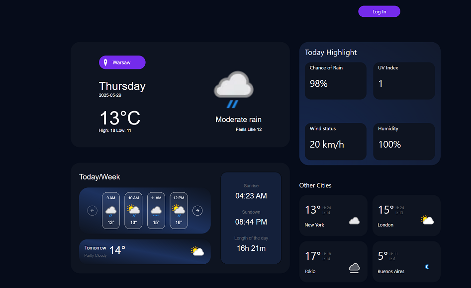
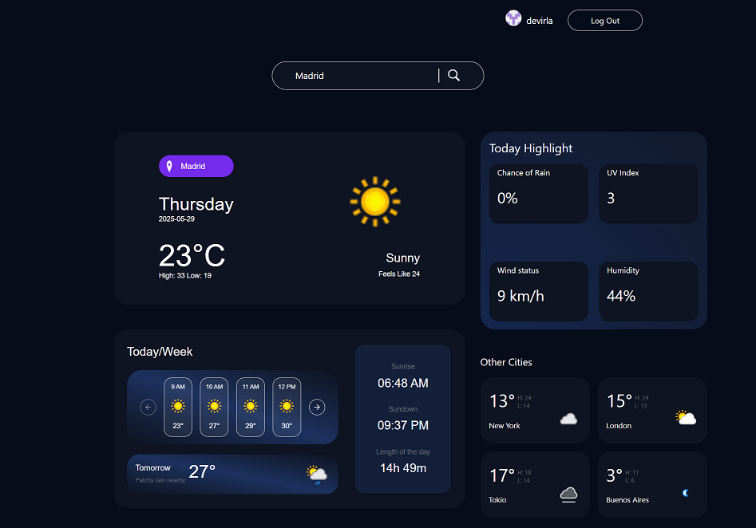

# Weather dashboard built with NEXT.JS

## Table of Contents

<ul>
  <li>[General info](#general-info)</li>
  <li>[Screens](#screens)</li>
  <li>[Features](#features)</li>
  <li>[Technologies](#technologies)</li>
  <li>[Setup](#setup)</li>
  <li>[Sources](#sources)</li>
</ul>

## General info

<p>
    Modern weather dashboard built in Next.js with a real-time weather forecast data from openweather API. User can look up for a current weather with a highlights in default city. He/she can also find forecast weather for szczegoloea 12 hours and tommorow weather. You can also find information about time of sunset, sunrise and length of the day. Application has also log in module by OAuth Github. After log in he/she can search for a specific city in searchbar.
</p>
<p>
    **Live Demo**: [https://weather-dashboard-next.vercel.app](https://weather-dashboard-next.vercel.app)
</p>

## Screens




## Features

<ul>
 <li>Current weather and forecast by city name. </li>
<li>12-hour forecast for default or selected city. Shows upcoming hourly temperatures and weather conditions </li>
<li>After logging in with Github account, user can download data by entering city name </li>
<li>Fully responsive and optimized for mobile and desktop views. </li>
<li>Using SSR for better performance and SEO benefits. </li>
</ul>

## Technologies

<ul> 
  <li>Next.js</li>
  <li>Typescript</li>
  <li>React</li>
  <li>Tailwind CSS</li>
  <li>OpenWeatherMap API</li>
  <li>Vercel</li>
</ul>

## Setup

To clone and run this application, you'll need Git and Node.js (which comes with npm) installed on your computer. From your command line:

1. **Clone the repository**

```bash
git clone https://github.com/your-username/weather-dashboard-next.git
cd weather-dashboard-
```

2.**Install dependecies**

```
npm install
# or
yarn install
```

3. Configure environment variables

Create a .env.local file in the root directory:

```
NEXT_PUBLIC_WEATHER_API_KEY=your_openweathermap_api_key
```

4. Run the app locally

```
npm run dev
# or
yarn dev
```

Open http://localhost:3000 in your browser.

## Sources

Project design based on: https://www.figma.com/design/O3B0Pg7cdCyBf7sHBeZMA9/Weather-Dashboard--Community-?node-id=0-1&t=Rnq4Ev8019s29iA6-0
